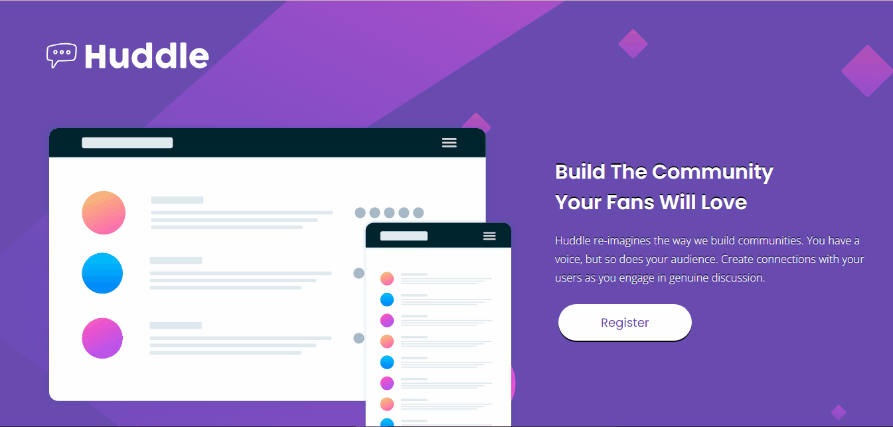
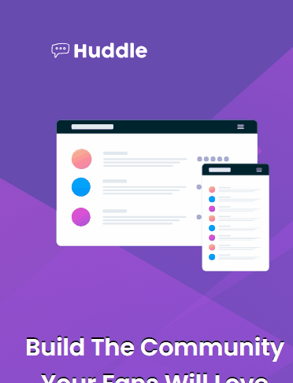

# Landing page Huddle
##  Descrição
Projeto para desenvolver uma landing page com os arquivos fornecidos pelo site Frontend Mentor, com o objetivo de mostrar e praticar os conhecimentos adquiridos no curso DevQuest.
Foi desenvolvida uma página para desktop e um responsivo para mobile.
Com ícones clicáveis.
### Desktop

### Mobile

## Tecnologias utilizadas
- HTML
- CSS
### Cores
- Violeta: hsl(257, 40%, 49%)
- Magenta suave: hsl(300, 69%, 71%)
##  Tipografia
###  Títulos
- Fonte: Poppins
- Pesos: 400, 600
###  Texto
- Fonte: Open Sans
- Pesos: 400
###  Ícones
- FontAwesome

### Desafios
Criar esse projeto foi bem desafiador, demorei um tempo, acredito que acima da média, para conseguir desenvolver. Mas esse tempo me trouxe muitas experiências e resiliência, aprendi a ter mais paciência comigo mesma, pesquisei bastante, refis algumas aulas. Refiz várias vezes o projeto, mas ao final fiquei orgulhosa de ter alcançado o meu objetivo e ter me superado.
Foi gratificante conseguir desenvolver a página.
